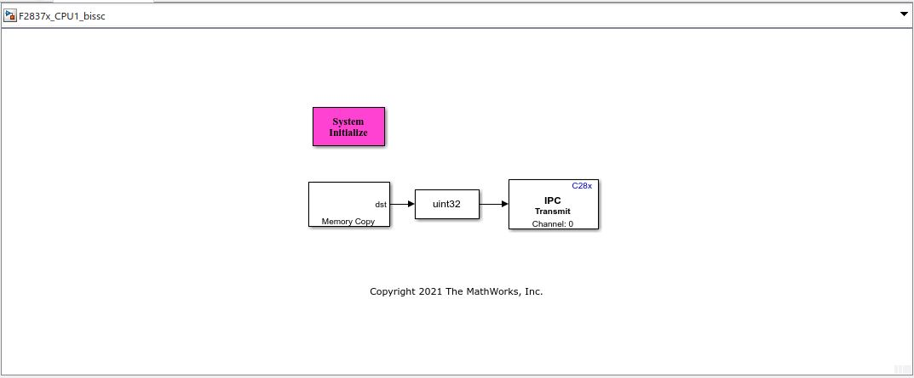
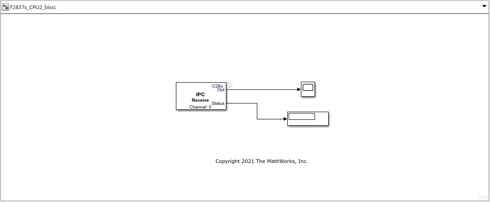

# **Reading BiSS-C Absolute Encoder in Simulink® using Texas Instruments (TI) Position Manager board.**
<!-- This is the "Title of the contribution" that was approved during the Community Contribution Review Process --> 

  
<!-- Add this icon to the README if this repo also appears on File Exchange via the "Connect to GitHub" feature --> 

This example shows how to interface a BiSS-C Absolute Encoder using the TI Position Manager board from Simulink. The model file 'F2837x_CPU1_bissc.slx' would run on CPU1 to read the position information and transmit the same to CPU2 via IPC. The model 'F2837x_CPU2_bissc.slx' is configured to run in external mode on CPU2 and would display the position information as received from CPU1. Applications generally capture position on one CPU core and using the captured position in algorithms in another CPU core. Hence the approach.

Open the model 'F2837x_CPU1_bissc.slx' and 'F2837x_CPU2_bissc.slx'  to get started.

Refer to the design document 'Simulink_BiSS_Encoder_Interface_F2837x.pdf' for more details.

Refer to the demo video: https://www.youtube.com/watch?v=FxRkGY6WPRM&t=21s

<!--- If your project includes a visualation or any images or an App please include a screenshot in this README --->

## **Simulink BiSS-C Encoder Interface Model**
 

### MathWorks Products (http://www.mathworks.com)

Requires MATLAB® release R2020b or newer, Simulink and Embedded Coder®.

## Community Support
[MATLAB Central](https://www.mathworks.com/matlabcentral)

Copyright 2021 The MathWorks, Inc.

