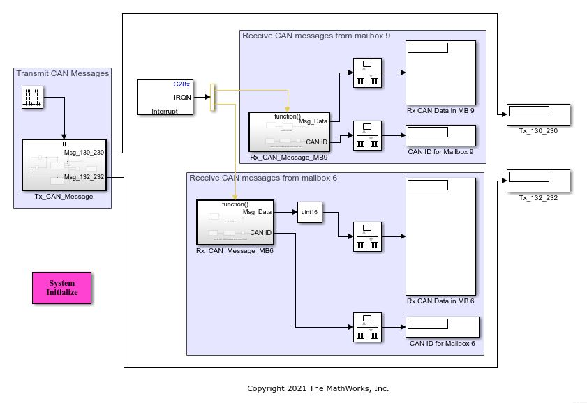

# **CAN Multiple ID Transmit Receive Support using Embedded Coder® Texas Instruments (TI) C2000™ Support Package.**
<!-- This is the "Title of the contribution" that was approved during the Community Contribution Review Process --> 

  
<!-- Add this icon to the README if this repo also appears on File Exchange via the "Connect to GitHub" feature --> 
This example shows how to configure a given CAN mailbox to support multiple CAN identifiers from Simulink®. The demo model 'CAN_MultiID_Transmit_Receive_F2837xD.slx' and 'CAN_MultiID_Transmit_Receive_F28004x.slx' will demonstarte below workflows on F2837xD and F28004x MCUs respectively.

1. Use CAN Pack blocks with CAN Tx and transmit multiple message IDs from a single mailbox.
2. To configure a mailbox as CAN Rx mailbox and receive multiple message IDs from a single mailbox.
3. To enable the loop back mode for self-test.
4. To read the CAN message only when a new message is received by using interrupts.
5. To read the CAN IDs using Memory copy block.

Open the model files 'CAN_MultiID_Transmit_Receive_F2837xD.slx' or 'CAN_MultiID_Transmit_Receive_F28004x.slx' to get started.

Refer to the design document 'CAN_Mailbox_Multiple_ID_Support.pdf' for more details.

Refer demo video: https://www.youtube.com/watch?v=-bf1tFDmiUQ&t=85s

<!--- If your project includes a visualation or any images or an App please include a screenshot in this README --->

## **CAN Multi-ID Transmit/Receive Support Model**
 

### MathWorks Products (http://www.mathworks.com)

Requires MATLAB® release R2020b or newer, Simulink and Embedded Coder.

## Community Support
[MATLAB Central](https://www.mathworks.com/matlabcentral)

Copyright 2021 The MathWorks, Inc.

