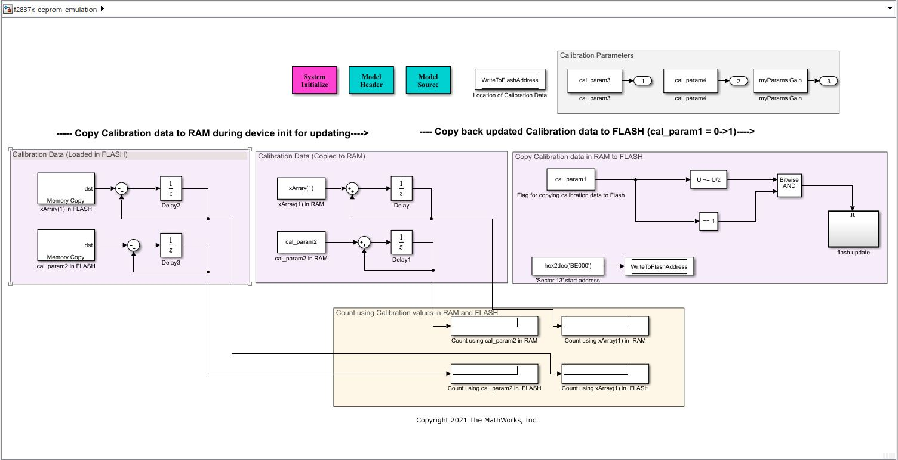

# **FLASH EEPROM Emulation from Simulink® using Embedded Coder® Texas Instruments (TI) C2000™ Support Package**
<!-- This is the "Title of the contribution" that was approved during the Community Contribution Review Process --> 

  
<!-- Add this icon to the README if this repo also appears on File Exchange via the "Connect to GitHub" feature --> 
This example shows how to store data to Flash from Simulink. The demo model 'f2837x_eeprom_emulation.slx' will demonstrate a basic framework for achieving EERPOM Emulation over Flash. The model will showcase how one can define calibration parameters that will be loaded to Flash sector reserved for EEPROM emulation (achieved through a separate load and run addresses for these parameters, and a copy is performed to move from the Flash to the RAM at runtime such that modifying them is possible). The calibration values as updated in RAM are then copied back to Flash for reuse even after power cycle using the TI Flash API routines.

Open the model 'f2837x_eeprom_emulation.slx' to get started.

Refer to the design document 'Simulink_EEPROM_Emulation_f2837x.pdf' for more details.

Refer to the demo video: https://www.youtube.com/watch?v=fWZoXDdff3Q

<!--- If your project includes a visualation or any images or an App please include a screenshot in this README --->

## **EEPROM Emulation Model**
 

### MathWorks Products (http://www.mathworks.com)

Requires MATLAB® release R2020b or newer, Simulink and Embedded Coder.

## Community Support
[MATLAB Central](https://www.mathworks.com/matlabcentral)

Copyright 2021 The MathWorks, Inc.

